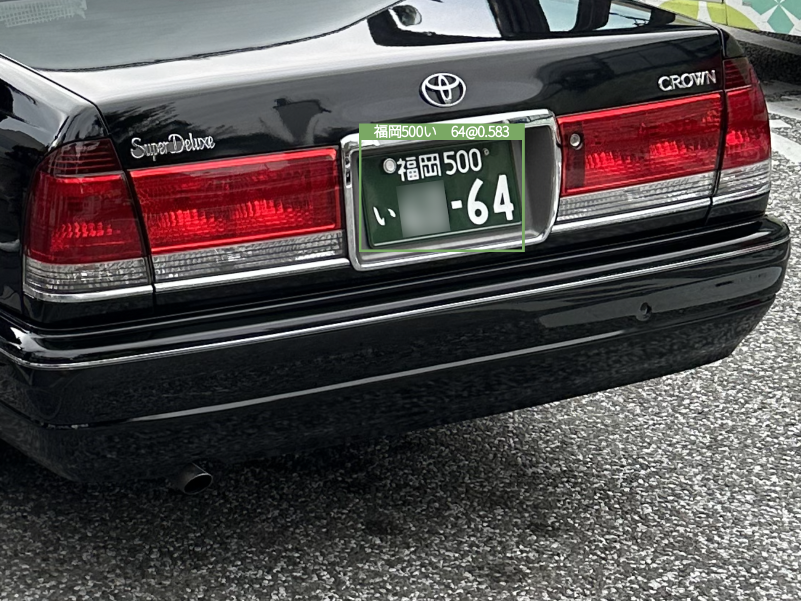
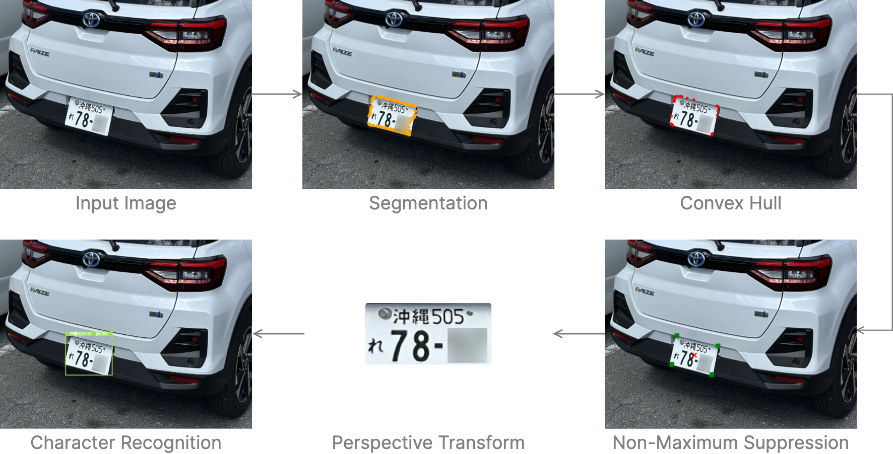

# Japanese License Plate Recognition
<table>
  <tr>
    <td></td>
    <td></td>
    <td></td>
  </tr>
</table>
Japanese license plate recognition project implemented with PyTorch, YOLOv8 and OpenCV. For research purpose only. 

## Demo App
### Hugging Face Spaces

Check out the demo app on [Hugging Face Spaces](https://huggingface.co/spaces/eepj/lprs-jp).

## Japanese License Plate Format
### Markings
<table>
  <tr>
    <td></td>
    <td>① Registered Region ② Classification Number ③ Kana Character ④ 4-Digit Designation Number</td>
  </tr>
</table>

### Color Scheme
<table>
  <tr>
    <th>License Plate Type</th>
    <th>Engine Displacement</th>
    <th>Marking Color</th>
    <th>Background Color</th>
  </tr>
  <tr>
    <td>Private Vehicles</td>
    <td>≥ 660 cc</td>
    <td>Green</td>
    <td>White</td>
  </tr>
  <tr>
    <td>Private Vehicles </td>
    <td>< 660 cc</td>
    <td>Black</td>
    <td>Yellow</td>
  </tr>
  <tr>
    <td>Commercial Vehicles</td>
    <td>≥ 660 cc</td>
    <td>White</td>
    <td>Green</td>
  </tr>
  <tr>
    <td>Commercial Vehicles</td>
    <td>< 660 cc</td>
    <td>Yellow</td>
    <td>Black</td>
  </tr>
  <tr>
    <td>Commemorative Plates</td>
    <td>–</td>
    <td>Green</td>
    <td>Multiple</td>
  </tr>
  <!--
  <tr>
    <td>Glowing</td>
    <td>–</td>
    <td>Neon Green</td>
    <td>White</td>
  </tr>
  -->
</table>

<!--
## Datasets
### License Plates Dataset
* Dataset comprising 350 vehicles and their corresponding license plate bounding boxes for fine-tuning YOLOv8 segmentation model to detect license plates from images.

### alpr_jp
* Dataset comprising 1000+ unlabeled Japanese license plate images for training character recognition models.
* Google Search images were used to supplement the dataset in case of missing or less common markings.
* All markings were manually labeled.
-->

## Approach

## Training

### Model
* CNN adapted from *Chinese License Plate Recognition System Based on Convolutional Neural Network*

### Hardware
* Apple M1 with MPS hardware acceleration

### Hyperparameters
* Number of epochs: 100
* Optimizer: Adam
* Initial learning rate: 1e-3
* Learning rate scheduler: StepLR, reduce by factor of 0.1 every 30 epochs
* Loss function: CrossEntropyLoss
* Random seed: 42

<!--
### Data Augmentation
 * Training images were passed to a 7-step augmenetation pipeline to enhance the model's robustness against image quality, camera angles and color variations.

-->

## Performance
### OCR
<table>
  <tr>
    <th></th>
    <th>Layer Depths</th>
    <th>Samples</th>
    <th>Classes</th>
    <th>Accuracy</th>
    <th>F1 Score</th>
    <th>Params (×103)</th>
  </tr>
  <tr>
    <td>① Region Name</td>
    <td style="white-space: nowrap;">64, 128, 256, 512</td>
    <td>412</td>
    <td>134</td>
    <td>0.976</td>
    <td>0.973</td>
    <td>1690</td>
  </tr>
  <tr>
    <td>② Classification Number</td>
    <td style="white-space: nowrap;">64, 128, 256</td>
    <td>444</td>
    <td>11</td>
    <td>0.984</td>
    <td>0.984</td>
    <td>440</td>
  </tr>
  <tr>
    <td>③ Kana Character</td>
    <td style="white-space: nowrap;">64, 128, 256, 512</td>
    <td>430</td>
    <td>43</td>
    <td>0.979</td>
    <td>0.978</td>
    <td>680</td>
  </tr>
  <tr>
    <td>④ Designation Number</td>
    <td style="white-space: nowrap;">64, 128, 256, 512</td>
    <td>547</td>
    <td>11</td>
    <td>0.998</td>
    <td>0.998</td>
    <td>646</td>
  </tr>
</table>

### Example Test Case
<!---->

## References
**alpr_jp**
 
Big thanks to dyama san for sharing the alpr_jp dataset.
 
https://github.com/dyama/alpr_jp

**Chinese License Plate Recognition System Based on Convolutional Neural Network**
 
H. Chen, Y. Lin, and T. Zhao, 'Chinese License Plate Recognition System Based on Convolutional Neural Network', Highlights in Science, Engineering and Technology, vol. 34, pp. 95–102, 2023.
 
https://www.researchgate.net/publication/369470024

**License Plates Dataset**
 
https://universe.roboflow.com/samrat-sahoo/license-plates-f8vsn

**YOLOv8**
 
https://github.com/ultralytics/ultralytics

**ナンバープレートの見方 (How to Read a Number Plate)**
 
https://wwwtb.mlit.go.jp/tohoku/jg/jg-sub29_1.html

## Fun Fact
This repository was created on [Leap Day 2024](https://doodles.google/doodle/leap-day-2024/).
