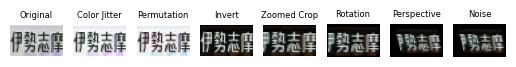

# **Japanese License Plate Recognition**

 
Intended for research purposes only.

## **Web Demo**
Check out the web demo at [https://huggingface.co/spaces/eepj/jlpr](https://huggingface.co/spaces/eepj/jlpr).

You can run the model on the example images or on your own images.
The vehicles must be partially visible for the license plates to be detected. As of now the model can only identify license plate numbers if they are appropriately angled.

## **Feature Roadmap**
### **License Plate Detection**
✅ Single license plate detection  
✅ Multiple license plate detection  

### **Character Recognition**
✅ Identification number recognition  
✅ Full license plate recognition  

### **Suppported License Plate Types**
✅ Standard license plates 
✅ Commemorative license plates 
✅ Character-glowing license plates 

### **To Be Implemented**
❎ License plate perspective unwarping 
 
## **Approach**
### **License Plate Localization**
The **License Plates Dataset** comprises images of various vehicles annotated with their corresponding license plate bounding boxes. The dataset comes with 350 annotated images of license plates in a 70-20-10 split ratio.

The license plate detection model was fine-tuned on a pre-trained YOLOv8 backbone. All localized license plates are resized to 128x64 pixels for further processing.

### **Character Recognition**
Most of the images used for training the character recognition models were available from the **alpr_jp** dataset. But if a region code was missing from **alpr_jp**, additional images from Google Search were used to supplement the dataset.

Whenever possible, a minimum of 10 images were gathered for each marking. As the occurence of some markings is relatively rare, the minimum number of these markings could not be guaranteed.

Characters were extracted from **alpr_jp** images with pre-defined ROIs and labeled manually. The labeled images was stratified in a 60-20-20 split ratio.

The character recognition problem is modeled as a multi-class classification problem. The model described in *Chinese License Plate Recognition System Based on Convolutional Neural Network* was implemented with PyTorch.

### **Data Augmentation**
A data augmentation pipeline was used to increase the diversity of training samples. Below is an example of an white-on-green region code generated from a green-on-white sample through the data augmentation pipeline:

## **Training**
### **Hardware and Schedule**
The models were trained on an Apple 7-core GPU M1 processor with MPS hardware acceleration. Each model was trained for 100 epochs.

### **Optimizer and Learning Rate**
The models were trained using the Adam optimizer with cross entropy loss. The initial learning rate was set to 1e-3, and the learning rate is adjusted by a factor of 0.1 every 30 epochs.

## **Metrics**
### **License Plate Localization**
|Model|Precision(B)|Recall(B)|mAP50(B)|mAP50-95(B)|Fitness|
|-----|------------|---------|--------|-----------|-------|
|**Fine-tuned YOLOv8**|0.84940|0.75702|0.85128|0.63573|0.65729|

### **Character Recognition**
|Model|Convolutional Layers|Samples (Classes)|Accuracy|Weighted F1|Params (103)||
|-----|------------|-------------|--------|-----------|-----------------------|-|
|**Region Code**   |32, 64, 128 32, 64, 128, 256 16, 32, 64, 128|412 (134)   |0.93046 0.97816 0.97330|0.92476 0.97543 0.97289|368 462 132| ✅ (a)|
|**Vehicle Class Code**   |32, 64, 128 16, 32, 64  |444 (11)   |0.97478 0.98423  |0.97760 0.98298  |97.9 25.9  |(b) ✅  |
|**Hiragana Code**   |32, 64, 128 32, 64, 128, 256 16, 32, 64, 128|430 (43)   |0.95814 0.97907 0.97674|0.95581 0.97776 0.97519|143 400 103| ✅ (a)|
|**Identification Number**   |32, 64, 128 32, 64, 128, 256 16, 32, 64|547 (11)   |0.99086 0.99269 0.99086|0.99092 0.99271 0.99086|104 395 29.4| (b) ✅|

## **Observations**
* (a) Model not deployed despite comparable metrics as a substantial decrease in confidence in the predicted classes was observed.

* (b) "*The bigger the better*" does not necessarily hold true. In some cases, increasing the number of parameters resulted in marginal improvement or degraded performance. The complexity of the problem should be taken into consideration.

* Degraded recognition performance on minority class markings is observed. This is likely due to insufficient training samples available for these classes.

## **References**
**alpr_jp**  
Huge thanks to dyama-san for sharing the dataset.  
https://github.com/dyama/alpr_jp

**License Plates Dataset**  
https://universe.roboflow.com/samrat-sahoo/license-plates-f8vsn

**Chinese License Plate Recognition System Based on Convolutional Neural Network**  
H. Chen, Y. Lin, and T. Zhao, ‘Chinese License Plate Recognition System Based on Convolutional Neural Network’, Highlights in Science, Engineering and Technology, vol. 34, pp. 95–102, 2023.  
https://www.researchgate.net/publication/369470024

## **Fun Fact**
This repository was created on [Leap Day 2024](https://doodles.google/doodle/leap-day-2024/).