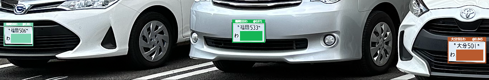
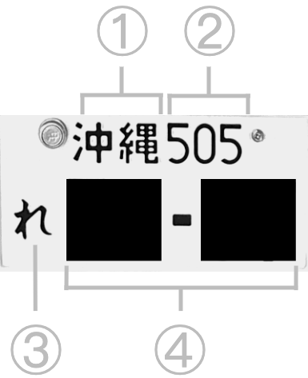

# **Japanese License Plate Recognition**

 
> [!Note]
> For personal research purposes only.

## **Hugging Face Space Demo**
Check out the demo at [https://huggingface.co/spaces/eepj/jlpr](https://huggingface.co/spaces/eepj/jlpr).

You can run the model on the example images or upload your own images.
The vehicles must be partially visible for the license plates to be detected. As of now the model can only identify license plate numbers if they are appropriately angled.

## **Japanese License Plate Format**
<table>
  <tr>
    <td>
      
    </td>
    <td>
      ① Issuing Office Code 
      ② Classification Number 
      ③ Kana Character 
      ④ 4-Digit Designation Number (Leading zeros are shown as ．)
    </td>
  </tr>
</table>

## **Training**
### **Hardware and Schedule**
The models were trained on an M1 processor with MPS hardware acceleration. Each model was trained for 100 epochs.

### **Optimizer and Learning Rate**
The models were trained using the Adam optimizer with cross entropy loss. The initial learning rate was set to 1e-3, and the learning rate was reduced by factor of 0.1 every 30 epochs.

## **Metrics**
### **License Plate Localization**
<table>
  <tr>
    <th>Precision(B)</th>
    <th>Recall(B)</th>
    <th>mAP50(B)</th>
    <th>mAP50-95(B)</th>
    <th>Fitness</th>
  </tr>
  <tr>
    <td>0.84940</td>
    <td>0.75702</td>
    <td>0.85128</td>
    <td>0.63573</td>
    <td>0.65729</td>
  </tr>
</table>

### **Character Recognition**
<table>
  <tr>
    <th>Recognition Task</th>
    <th>Convolutional Layers</th>
    <th>Samples (Classes)</th>
    <th>Accuracy</th>
    <th>Weighted F1</th>
    <th>Params (×103)</th>
    <th></th>
  </tr>
  <tr>
    <td>① Issuing Office Code</td>
    <td>32, 64, 128 32, 64, 128, 256 16, 32, 64, 128</td>
    <td>412 (134)</td>
    <td>0.93046 0.97816 0.97330</td>
    <td>0.92476 0.97543 0.97289</td>
    <td>368 462 132</td>
    <td> ✅ (a)</td>
  </tr>
  <tr>
    <td>② Classification Number</td>
    <td>32, 64, 128 16, 32, 64</td>
    <td>444 (11)</td>
    <td>0.97478 0.98423</td>
    <td>0.97760 0.98298</td>
    <td>97.9 25.9</td>
    <td>(b) ✅</td>
  </tr>
  <tr>
    <td>③ Kana Character</td>
    <td>32, 64, 128 32, 64, 128, 256 16, 32, 64, 128</td>
    <td>430 (43)</td>
    <td>0.95814 0.97907 0.97674</td>
    <td>0.95581 0.97776 0.97519</td>
    <td>143 400 103</td>
    <td> ✅ (a)</td>
  </tr>
  <tr>
    <td>④ Designation Number</td>
    <td>32, 64, 128 32, 64, 128, 256 16, 32, 64</td>
    <td>547 (11)</td>
    <td>0.99086 0.99269 0.99086</td>
    <td>0.99092 0.99271 0.99086</td>
    <td>104 395 29.4</td>
    <td> (b) ✅</td>
  </tr>
</table>

## **Observations**
* (a) Model not deployed despite comparable metrics as a substantial decrease in confidence in the predicted classes was observed.

* (b) Increasing the number of parameters resulted in marginal improvement or degraded performance.

## **References**
**alpr_jp**  
Big thanks to dyama san for sharing the dataset.  
https://github.com/dyama/alpr_jp

**License Plates Dataset**  
https://universe.roboflow.com/samrat-sahoo/license-plates-f8vsn

**Chinese License Plate Recognition System Based on Convolutional Neural Network**  
H. Chen, Y. Lin, and T. Zhao, 'Chinese License Plate Recognition System Based on Convolutional Neural Network', Highlights in Science, Engineering and Technology, vol. 34, pp. 95–102, 2023.  
https://www.researchgate.net/publication/369470024

**How to Read License Plates (ナンバープレートの見方)** 
https://wwwtb.mlit.go.jp/tohoku/jg/jg-sub29_1.html

## **Fun Fact**
This repository was created on [Leap Day 2024](https://doodles.google/doodle/leap-day-2024/).